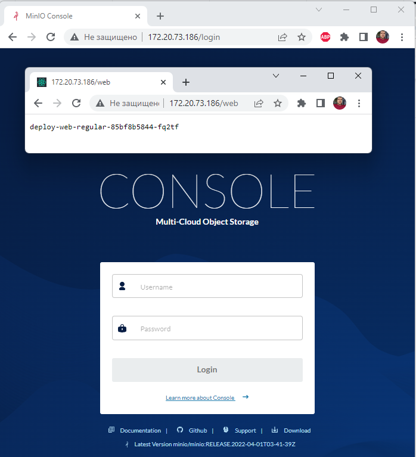

# Task 3

# Homework
# Task 3.1, 3.2
* We published minio "outside" using nodePort. Do the same but using ingress.
* Publish minio via ingress so that minio by ip_minikube and nginx returning hostname (previous job) by path ip_minikube/web are available at the same time.
## Solution
You need to run the bash script
```bash
./run1.sh
```
Output:
```bash
$ ./run1.sh
namespace/minio created
NAME                   STATUS   AGE
default                Active   4d
ingress-nginx          Active   3d21h
kube-node-lease        Active   4d
kube-public            Active   4d
kube-system            Active   4d
kubernetes-dashboard   Active   4d
minio                  Active   0s
Context "minikube" modified.
persistentvolume/minio-deployment-pv created
NAME                  CAPACITY   ACCESS MODES   RECLAIM POLICY   STATUS      CLAIM   STORAGECLASS   REASON   AGE
minio-deployment-pv   5Gi        RWO            Retain           Available                                   0s
persistentvolumeclaim/minio-deployment-claim created
NAME                     STATUS   VOLUME                CAPACITY   ACCESS MODES   STORAGECLASS   AGE
minio-deployment-claim   Bound    minio-deployment-pv   5Gi        RWO                           0s
NAME                  CAPACITY   ACCESS MODES   RECLAIM POLICY   STATUS   CLAIM                          STORAGECLASS   REASON   AGE
minio-deployment-pv   5Gi        RWO            Retain           Bound    minio/minio-deployment-claim                           1s
deployment.apps/minio created
NAME                    READY   STATUS              RESTARTS   AGE
minio-94fd47554-pl2xh   0/1     ContainerCreating   0          0s
service/service-minio created
configmap/nginx-configmap created
deployment.apps/deploy-web-regular created
NAME                                  READY   STATUS              RESTARTS   AGE
deploy-web-regular-85bf8b5844-q6l8x   0/1     ContainerCreating   0          0s
minio-94fd47554-pl2xh                 0/1     ContainerCreating   0          2s
service/service-web-regular created
ingress.networking.k8s.io/ingress-minio created
NAME                                  READY   STATUS    RESTARTS   AGE   IP           NODE       NOMINATED NODE   READINESS GATES
deploy-web-regular-85bf8b5844-q6l8x   1/1     Running   0          6s    172.17.0.6   minikube   <none>           <none>
minio-94fd47554-pl2xh                 1/1     Running   0          8s    172.17.0.5   minikube   <none>           <none>
<!doctype html><html lang="en"><head><meta charset="utf-8"/><base href="/"/><meta content="width=device-width,initial-scale=1" name="viewport"/><meta content="#081C42" media="(prefers-color-scheme: light)" name="theme-color"/><meta content="#081C42" media="(prefers-color-scheme: dark)" name="theme-color"/><meta content="MinIO Console" name="description"/><link href="./styles/root-styles.css" rel="stylesheet"/><link href="./apple-icon-180x180.png" rel="apple-touch-icon" sizes="180x180"/><link href="./favicon-32x32.png" rel="icon" sizes="32x32" type="image/png"/><link href="./favicon-96x96.png" rel="icon" sizes="96x96" type="image/png"/><link href="./favicon-16x16.png" rel="icon" sizes="16x16" type="image/png"/><link href="./manifest.json" rel="manifest"/><link color="#3a4e54" href="./safari-pinned-tab.svg" rel="mask-icon"/><title>MinIO Console</title><script defer="defer" src="./static/js/main.c1bfdfdb.js"></script><link href="./static/css/main.90d417ae.css" rel="stylesheet"></head><body><noscript>You need to enable JavaScript to run this app.</noscript><div id="root"><div id="preload"> </div><div id="loader-block"></div></div></body></html>
deploy-web-regular-85bf8b5844-q6l8x
```
## Result

# Task 3.3
* Create deploy with emptyDir save data to mountPoint emptyDir, delete pods, check data.
## Solution
You need to run the bash script
```bash
./run2.sh
```
## Result
```bash
$ ./run2.sh
deployment.apps "deploy-emptydir" deleted
        volumeMounts:
          - name: cache-volume
            mountPath: /emptyDir
      volumes:
        - name: cache-volume
          emptyDir: {}
deployment.apps/deploy-emptydir created
NAME              READY   UP-TO-DATE   AVAILABLE   AGE
deploy-emptydir   0/1     1            0           1s
NAME                              READY   STATUS    RESTARTS   AGE
deploy-emptydir-d8f45fd76-6czvl   1/1     Running   0          5s
total 0
-rw-r--r-- 1 root root 0 Apr  4 18:40 file.txt
pod "deploy-emptydir-d8f45fd76-6czvl" deleted
NAME                              READY   STATUS    RESTARTS   AGE
deploy-emptydir-d8f45fd76-qc5d2   1/1     Running   0          6s
total 0
```
As we can see, file **file.txt** is missing.
# Task 3.4
* Optional. Raise an nfs share on a remote machine. Create a pv using this share, create a pvc for it, create a deployment. Save data to the share, delete the deployment, delete the pv/pvc, check that the data is safe.## Solution
You need to run the bash script several times:
```bash
./run3.sh
./run3.sh
```
## Result
```bash
admin@HOME-PC MINGW64 ~/28/task_3
$ ./run3.sh
persistentvolume/pv-nfs created
NAME     CAPACITY   ACCESS MODES   RECLAIM POLICY   STATUS      CLAIM   STORAGECLASS   REASON   AGE
pv-nfs   100Mi      RWX            Retain           Available           nfs                     1s
persistentvolumeclaim/pvc-nfs created
NAME      STATUS   VOLUME   CAPACITY   ACCESS MODES   STORAGECLASS   AGE
pvc-nfs   Bound    pv-nfs   100Mi      RWX            nfs            0s
NAME     CAPACITY   ACCESS MODES   RECLAIM POLICY   STATUS   CLAIM             STORAGECLASS   REASON   AGE
pv-nfs   100Mi      RWX            Retain           Bound    default/pvc-nfs   nfs                     2s
deployment.apps/deploy-web-nfs created
NAME             READY   UP-TO-DATE   AVAILABLE   AGE
deploy-web-nfs   0/1     1            0           0s
NAME                              READY   STATUS    RESTARTS   AGE   IP           NODE       NOMINATED NODE   READINESS GATES
deploy-web-nfs-785dd4b7b5-wdbn5   1/1     Running   0          5s    172.17.0.3   minikube   <none>           <none>
total 0
-rw-r--r-- 1 root root 0 Apr  6 04:47 Wed Apr  6 07:47:50 RTZ 2022.txt
deployment.apps "deploy-web-nfs" deleted
persistentvolumeclaim "pvc-nfs" deleted
persistentvolume "pv-nfs" deleted

admin@HOME-PC MINGW64 ~/28/task_3
$ ./run3.sh
persistentvolume/pv-nfs created
NAME     CAPACITY   ACCESS MODES   RECLAIM POLICY   STATUS      CLAIM   STORAGECLASS   REASON   AGE
pv-nfs   100Mi      RWX            Retain           Available           nfs                     0s
persistentvolumeclaim/pvc-nfs created
NAME      STATUS   VOLUME   CAPACITY   ACCESS MODES   STORAGECLASS   AGE
pvc-nfs   Bound    pv-nfs   100Mi      RWX            nfs            0s
NAME     CAPACITY   ACCESS MODES   RECLAIM POLICY   STATUS   CLAIM             STORAGECLASS   REASON   AGE
pv-nfs   100Mi      RWX            Retain           Bound    default/pvc-nfs   nfs                     1s
deployment.apps/deploy-web-nfs created
NAME             READY   UP-TO-DATE   AVAILABLE   AGE
deploy-web-nfs   0/1     1            0           0s
NAME                              READY   STATUS    RESTARTS   AGE   IP           NODE       NOMINATED NODE   READINESS GATES
deploy-web-nfs-785dd4b7b5-txwn2   1/1     Running   0          5s    172.17.0.3   minikube   <none>           <none>
total 0
-rw-r--r-- 1 root root 0 Apr  6 04:47 Wed Apr  6 07:47:50 RTZ 2022.txt
-rw-r--r-- 1 root root 0 Apr  6 04:48 Wed Apr  6 07:48:01 RTZ 2022.txt
deployment.apps "deploy-web-nfs" deleted
persistentvolumeclaim "pvc-nfs" deleted
persistentvolume "pv-nfs" deleted
```
As we can see, files in folder /nfs-data are persistent

### [Read more about CSI](https://habr.com/ru/company/flant/blog/424211/)
### Create pv in kubernetes
```bash
kubectl apply -f pv.yaml
```
### Check our pv
```bash
kubectl get pv
```
### Sample output
```bash
NAME                  CAPACITY   ACCESS MODES   RECLAIM POLICY   STATUS      CLAIM   STORAGECLASS   REASON   AGE
minio-deployment-pv   5Gi        RWO            Retain           Available                                   5s
```
### Create pvc
```bash
kubectl apply -f pvc.yaml
```
### Check our output in pv 
```bash
kubectl get pv
NAME                  CAPACITY   ACCESS MODES   RECLAIM POLICY   STATUS   CLAIM                            STORAGECLASS   REASON   AGE
minio-deployment-pv   5Gi        RWO            Retain           Bound    default/minio-deployment-claim                           94s
```
Output is change. PV get status bound.
### Check pvc
```bash
kubectl get pvc
NAME                     STATUS   VOLUME                CAPACITY   ACCESS MODES   STORAGECLASS   AGE
minio-deployment-claim   Bound    minio-deployment-pv   5Gi        RWO                           79s
```
### Apply deployment minio
```bash
kubectl apply -f deployment.yaml
```
### Apply svc nodeport
```bash
kubectl apply -f minio-nodeport.yaml
```
Open minikup_ip:node_port in you browser
### Apply statefulset
```bash
kubectl apply -f statefulset.yaml
```
### Check pod and statefulset
```bash
kubectl get pod
kubectl get sts
```

### Homework
* We published minio "outside" using nodePort. Do the same but using ingress.
* Publish minio via ingress so that minio by ip_minikube and nginx returning hostname (previous job) by path ip_minikube/web are available at the same time.
* Create deploy with emptyDir save data to mountPoint emptyDir, delete pods, check data.
* Optional. Raise an nfs share on a remote machine. Create a pv using this share, create a pvc for it, create a deployment. Save data to the share, delete the deployment, delete the pv/pvc, check that the data is safe.